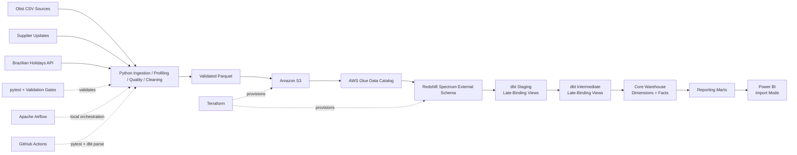
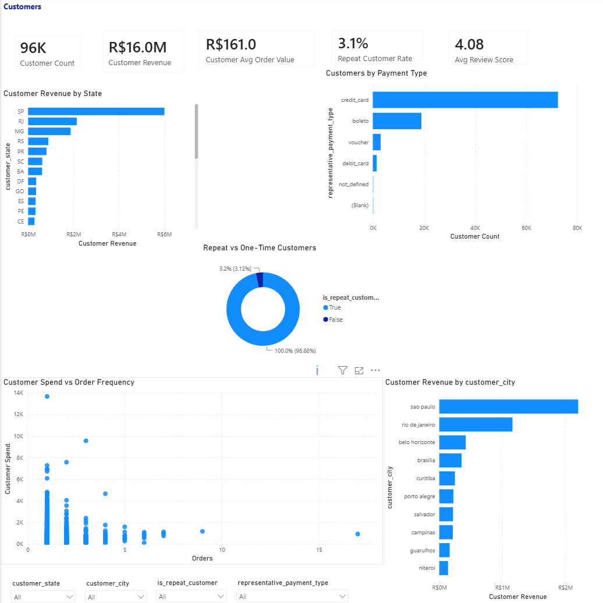
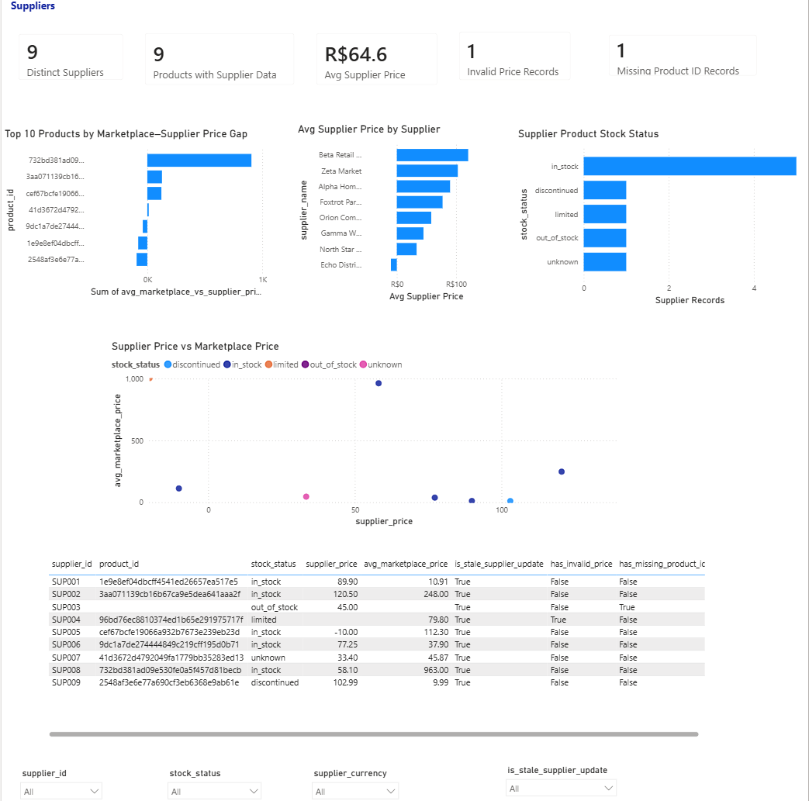

# Retail Analytics Data Platform

A production-style, end-to-end data engineering and analytics portfolio project built around realistic retail and e-commerce workflows.

The platform demonstrates the full path from source onboarding and data-quality validation to cloud storage, warehouse modeling, orchestration, infrastructure as code, CI, and business reporting in Power BI.

## Project Highlights

- **3 source families:** Olist e-commerce data, supplier product updates, and Brazilian public-holiday API data
- **11 curated dbt sources**
- **34 dbt models**
- **39 dbt data tests**
- **6 validated reporting marts**
- **81 / 0 raw quality checks passed / failed**
- **72 / 0 cleaning validation checks passed / failed**
- **AWS S3 + Glue + Redshift Spectrum + Redshift Serverless**
- **Terraform-managed cloud infrastructure**
- **Apache Airflow orchestration for the local workflow**
- **GitHub Actions CI**
- **6-page Power BI report built on the validated reporting marts**
- **Cost-aware Redshift Serverless development with RPU limits and usage controls**

---

## Final Architecture



### Cloud serving path

```text
Validated Parquet
→ Amazon S3
→ AWS Glue Data Catalog
→ Redshift Spectrum
→ dbt staging
→ dbt intermediate
→ core dimensions and facts
→ reporting marts
→ Power BI
```

The earlier PostgreSQL implementation remains in the repository as a local development/orchestration phase. The current portfolio warehouse is the Redshift-based `dbt/` project.

---

## Business Context

The platform supports analysis for a retail / e-commerce business and answers questions around:

- revenue and sales trends
- order and item volume
- customer value and repeat behavior
- product-category performance
- seller geography
- delivery speed and late-delivery risk
- supplier price and stock health
- supplier-source data quality
- public-holiday impact on delivery operations
- pipeline validation and data-quality health

The project is designed to connect engineering decisions to business outcomes rather than treating ETL, modeling, and BI as separate exercises.

---

## Data Sources

### 1. Olist Brazilian E-Commerce

The main transactional dataset includes:

- customers
- geolocation
- orders
- order items
- order payments
- order reviews
- products
- product-category translation
- sellers

### 2. Supplier Product Updates

A deliberately messy business feed used to demonstrate realistic data-quality handling, including:

- missing product IDs
- missing currency values
- invalid and negative prices
- unknown stock statuses
- invalid dates / timestamps
- duplicate business keys

Quality exceptions are retained and flagged rather than silently removed.

### 3. Brazilian Public Holidays

Public-holiday data is extracted from the Nager.Date API and used to enrich delivery and operational analysis.

---

## Data Quality and Validation

The project uses validation at multiple stages instead of relying on a single final check.

| Validation layer | Verified result |
| --- | ---: |
| Raw quality checks | **81 PASS / 0 FAIL** |
| Cleaning validation | **72 PASS / 0 FAIL** |
| dbt data tests | **39 tests validated** |
| Curated dbt sources | **11** |
| dbt models | **34** |
| Reporting marts | **6** |

Quality controls include source profiling, schema and required-field checks, cleaning validation, business-rule flags, audit records, dbt tests, pytest, and CI validation.

A successful pipeline does **not** mean pretending source data is perfect. Supplier-source exceptions remain observable through explicit quality flags and the final data-quality mart.

---

## dbt Warehouse Design

The current Redshift dbt project is under:

```text
dbt/
```

It contains four analytical layers.

### Staging

Staging models normalize source naming and cast Glue string values into analytical data types. Because the source data is queried through Redshift Spectrum, staging models use late-binding views where required.

### Intermediate

Intermediate models resolve one-to-many relationships and protect analytical grain before facts are built.

Examples include:

- geolocation reduced to ZIP-level analytical grain
- payments aggregated to order level
- reviews aggregated to order level
- translated / enriched products
- latest supplier-product state
- enriched orders
- enriched order items
- product-level sales context

### Core Warehouse

Core models include:

- `dim_date`
- `dim_customers`
- `dim_products`
- `dim_sellers`
- `dim_suppliers`
- `fct_orders`
- `fct_order_items`
- `fct_payments`
- `fct_reviews`

Important grain rules are explicit. Supplier-product records are not joined directly into `fct_order_items`, preventing multi-supplier products from duplicating item-level revenue.

### Reporting Marts

The six validated reporting marts are:

- `mart_sales_performance`
- `mart_customer_behavior`
- `mart_delivery_operations`
- `mart_product_performance`
- `mart_supplier_product_health`
- `mart_data_quality`

All six marts were execution-validated in Redshift and the marts test suite passed.

---

## Power BI Report

Power BI consumes the validated reporting layer in **Import mode**.

The final report contains six pages:

| Page | Purpose |
| --- | --- |
| **Executive Overview** | Revenue, orders, customers, AOV, repeat rate, sales trend and delivery KPIs |
| **Sales & Products** | Revenue, units, product performance, category mix and seller-state performance |
| **Customers** | Customer value, repeat behavior, geography, payment type and spend frequency |
| **Delivery & Operations** | Delivery time, carrier handoff, late-delivery rate, holiday impact and state performance |
| **Suppliers** | Supplier price, marketplace-price comparison, stock status and supplier-product exceptions |
| **Data Quality & Pipeline Health** | Pipeline validation checkpoints plus supplier-source quality exceptions |

### Executive Overview


### Sales & Products


### Customers



### Delivery & Operations


### Suppliers



### Data Quality & Pipeline Health


Power BI assets are stored under:

```text
powerbi/
```

---

## AWS and Cost Controls

The cloud extension was implemented deliberately with cost controls rather than leaving development resources unconstrained.

The project uses:

- Amazon S3 for curated data-lake storage
- AWS Glue Data Catalog
- Redshift Spectrum
- Redshift Serverless
- AWS Secrets Manager for managed Redshift credentials
- Terraform for infrastructure provisioning

Redshift Serverless is configured with controlled capacity and a usage limit. During development, dbt builds were executed layer-by-layer to avoid unnecessary warehouse compute.

Power BI uses **Import mode** so interacting with the report does not continuously query Redshift.

---

## Infrastructure as Code

Terraform code is under:

```text
infra/terraform/
```

Terraform manages the AWS resources required by the cloud analytics path, including data-lake and Redshift Serverless components.

Local credentials, state, `.tfvars`, dbt profiles, and generated artifacts should never be committed.

---

## Orchestration

Apache Airflow is used for the tested local workflow through Docker Compose.

Current DAGs include:

| DAG | Purpose |
| --- | --- |
| `retail_local_full_refresh` | Refreshes the local analytics workflow |
| `br_holidays_api_refresh` | Refreshes the public-holiday enrichment pipeline |

The Airflow layer coordinates existing Python / validation / database / dbt steps rather than embedding business transformation logic inside DAG files.

The local PostgreSQL workflow is retained as an earlier implementation stage and demonstrates orchestration, recovery, audit, and local reproducibility.

---

## Testing and CI

Automated validation includes:

- `pytest`
- dbt parsing / project validation
- source and transformation quality gates
- GitHub Actions CI

The repository includes:

```text
.github/workflows/ci.yml
```

CI is designed to catch Python and dbt project issues before changes are merged.

---

## Repository Structure

```text
.
├── .github/workflows/       # GitHub Actions CI
├── airflow/dags/            # Airflow DAGs
├── data/                    # Source / local data layers
├── dbt/                     # Current Redshift dbt warehouse project
├── dbt_retail_analytics/    # Earlier PostgreSQL dbt implementation
├── docs/                    # Design notes and runbooks
├── infra/terraform/         # AWS infrastructure as code
├── powerbi/                 # Power BI files
├── reports/                 # Profiling / quality / validation reports
├── screenshots/             # Final and historical report screenshots
├── scripts/                 # Repeatable task / validation runners
├── sql/                     # SQL utilities and reference queries
├── src/retail_analytics/    # Python package
├── tests/                   # pytest tests
├── Dockerfile.airflow
├── docker-compose.yml
└── README.md
```

---

## Local Validation

The repository includes offline validation scripts for checking the project without consuming Redshift compute.

Typical checks include:

```text
Python syntax
→ pytest
→ dbt parse / dbt inventory
→ Docker Compose configuration
→ Terraform formatting / validation
→ Git hygiene
```

This separates inexpensive local validation from paid warehouse execution.

---

## Technical Stack

| Area | Technologies |
| --- | --- |
| Programming | Python, SQL, PowerShell |
| Data processing | pandas |
| Local database | PostgreSQL |
| Cloud storage | Amazon S3 |
| Catalog | AWS Glue |
| Cloud warehouse | Amazon Redshift Serverless / Spectrum |
| Transformation | dbt Core |
| Orchestration | Apache Airflow |
| Infrastructure as Code | Terraform |
| Containers | Docker / Docker Compose |
| Business Intelligence | Power BI |
| Testing | pytest, dbt tests, custom validation gates |
| CI/CD | GitHub Actions |
| Version control | Git / GitHub |

---

## Key Engineering Decisions

### Preserve source-quality exceptions
Supplier rows with quality problems remain observable through explicit flags instead of being removed simply to make downstream tests green.

### Protect analytical grain
Payments, reviews, geolocation, and supplier-product records are transformed at the correct grain before joining into facts.

### Separate business marts from source storage
Power BI consumes reporting marts rather than raw or Spectrum source tables.

### Use cloud compute deliberately
Redshift builds were tested in controlled layers, with Serverless usage limits and low-cost offline checks used wherever possible.

### Keep the local implementation
The PostgreSQL + Airflow implementation is retained as evidence of the project’s evolution from local fundamentals to a cloud warehouse rather than being presented as the current serving architecture.

---

## Project Status

**Complete and portfolio-ready.**

Verified end-to-end:

- source onboarding and profiling
- raw quality validation
- cleaning and validation
- Parquet publishing
- S3 / Glue / Spectrum integration
- Redshift Serverless connectivity
- dbt staging execution
- dbt intermediate execution
- core warehouse execution
- all six reporting marts
- final dbt tests
- Terraform infrastructure
- local Airflow orchestration
- automated tests / CI
- six-page Power BI report
- data-quality and pipeline-health reporting

---

## Portfolio Positioning

This project is not presented as an enterprise production system. It is a **production-style portfolio platform** designed to demonstrate realistic engineering decisions, validation discipline, cloud cost awareness, analytical modeling, and communication with business-facing BI.

It is especially relevant to roles such as:

- Junior Data Engineer
- Analytics Engineer
- BI / Data Engineer
- ETL Developer
- SQL Developer
- Data Analyst with strong Python / SQL engineering skills
