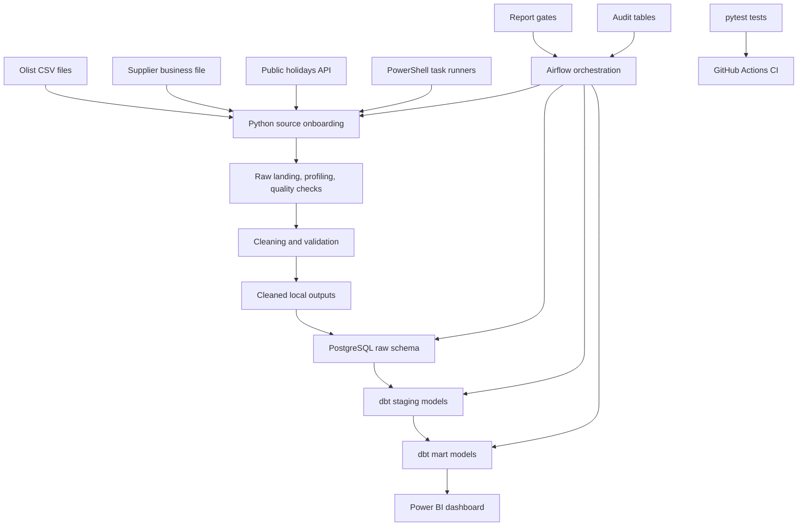

# Retail Analytics Data Platform

A production-style local data engineering and analytics platform built around realistic retail and e-commerce workflows.

This project demonstrates how raw business data can be onboarded, validated, cleaned, loaded into PostgreSQL, transformed with dbt, orchestrated with Airflow, tested with CI, and served to a Power BI dashboard.

---

## Project Purpose

This repository is built incrementally to simulate the type of work performed in junior or bridge data roles such as:

* Junior Data Engineer
* Analytics Engineer
* BI Developer
* ETL Developer
* SQL Developer
* Data Analyst with Python and SQL

The project starts locally to strengthen the fundamentals before moving into cloud infrastructure.

Current focus:

```text
source onboarding
→ data profiling
→ data quality checks
→ cleaning
→ cleaned output validation
→ PostgreSQL raw loading
→ load audit
→ dbt staging and marts
→ Power BI dashboard
→ local workflow automation
→ Airflow orchestration
→ testing and CI
```

Planned later:

```text
AWS and Terraform design
→ S3 / Glue / Redshift
→ dbt on cloud warehouse
→ controlled cloud implementation
```

---

## Business Context

The platform supports analysis for a retail/e-commerce business.

The business wants to understand:

* order volume
* revenue trends
* customer geography
* product category performance
* seller performance
* delivery performance
* payment behavior
* customer reviews
* supplier data quality
* public-holiday impact on orders, delivery, revenue, and reviews

The project is not only a technical pipeline. It is designed to connect engineering work to business questions.

---

## Data Sources

| Source                             | Type                              | Purpose                                                   | Status      |
| ---------------------------------- | --------------------------------- | --------------------------------------------------------- | ----------- |
| Retail E-Commerce Dataset | CSV / transactional-style dataset | Main retail/e-commerce operational data                   | Implemented |
| Supplier product updates           | Handmade messy business file      | Simulates supplier/business data quality issues           | Implemented |
| Public public holidays             | External API via Nager.Date       | Enriches order data with public-holiday context | Implemented |

---

## Current Architecture



---

## Repository Structure

```text
data/
  raw/                         # Original source files and API landing outputs
  processed/                   # Cleaned and validated outputs

dbt_retail_analytics/
  models/
    staging/                   # dbt staging models
    marts/                     # dbt business-facing models
    exposures.yml              # Power BI dashboard exposure
  dbt_project.yml
  profiles.yml                 # Local Airflow dbt profile

airflow/
  dags/                        # Airflow DAG definitions
  plugins/                     # Optional Airflow plugins
  logs/                        # Local Airflow logs, ignored by Git

docs/                          # Project documentation and runbooks
powerbi/                       # Power BI dashboard file
reports/                       # Profiling, quality, validation, and load reports
scripts/                       # Local PowerShell task runners
sql/                           # SQL scripts and reference queries
src/retail_analytics/          # Python package
tests/                         # Lightweight pytest tests
.github/workflows/             # GitHub Actions CI
```

Generated dbt artifacts such as `dbt_retail_analytics/target/` should not be committed.

---

## Local File Layers

| Layer             | Purpose                                                                |
| ----------------- | ---------------------------------------------------------------------- |
| `data/raw/`       | Original source files and raw API landing outputs                      |
| `data/processed/` | Cleaned and validated outputs                                          |
| `reports/`        | Inventory, profiling, quality, validation, and PostgreSQL load reports |
| `docs/`           | Architecture notes, runbooks, source design, and project documentation |
| `scripts/`        | Repeatable local task runners                                          |
| `airflow/dags/`   | Airflow orchestration definitions                                      |

---

## PostgreSQL Schemas

| Schema        | Purpose                                                    |
| ------------- | ---------------------------------------------------------- |
| `raw`         | Source-like tables loaded from cleaned validated files     |
| `staging`     | Earlier SQL prototype layer used before dbt migration      |
| `mart`        | Earlier SQL prototype mart layer used before dbt migration |
| `audit`       | Load audit and pipeline run metadata                       |
| `dbt_staging` | dbt-managed staging models                                 |
| `dbt_mart`    | dbt-managed business-facing models                         |

---

## Source Onboarding Pattern

Each source follows a repeatable onboarding pattern:

```text
extract / land raw data
→ inventory or profile
→ quality checks
→ clean / normalize
→ cleaned output validation
→ PostgreSQL raw load
→ PostgreSQL load validation
→ dbt source / staging / mart
→ BI reporting
→ documentation
```

This pattern has been applied to:

* Olist e-commerce data
* supplier product updates
* Public public holidays API data

---

## Implemented Pipelines

### Olist E-Commerce Data

The Olist dataset is used as the main e-commerce operational dataset.

It includes:

* customers
* orders
* order items
* order payments
* order reviews
* products
* sellers
* geolocation
* product category translation

### Supplier Product Updates

A handmade supplier source simulates realistic messy business data.

It includes examples of:

* missing product IDs
* missing currency values
* invalid prices
* negative prices
* unknown stock statuses
* invalid timestamps
* duplicate business keys

The supplier mart keeps problematic rows visible using quality flags and a `needs_business_review` indicator.

### Public Holidays API

Public holidays are extracted from the Nager.Date API and used to enrich the retail e-commerce data.

The holiday source supports analysis such as:

* order volume around public holidays
* revenue around holiday windows
* review score around holidays
* late delivery rate around holidays
* retail-relevant holiday grouping

---

## dbt Transformation Layer

The project uses dbt Core on top of PostgreSQL.

Flow:

```text
PostgreSQL raw tables
→ dbt sources
→ dbt staging models
→ dbt mart models
→ dbt tests
→ dbt documentation and lineage
→ dbt exposure for Power BI
```

Important dbt models include:

| Model                          | Purpose                                    |
| ------------------------------ | ------------------------------------------ |
| `stg_orders`                   | Standardized order lifecycle data          |
| `stg_order_items`              | Standardized item-level order data         |
| `stg_customers`                | Customer identity and geography            |
| `stg_products`                 | Product attributes and translated category |
| `stg_sellers`                  | Seller identity and geography              |
| `stg_order_payments`           | Payment data                               |
| `stg_order_reviews`            | Review scores and sentiment preparation    |
| `stg_supplier_product_updates` | Supplier update staging model              |
| `stg_br_holidays`              | Public holidays staging model       |
| `dim_customers`                | Customer dimension                         |
| `dim_products`                 | Product dimension                          |
| `dim_sellers`                  | Seller dimension                           |
| `dim_br_holidays`              | Public-holiday dimension            |
| `fct_orders`                   | Order lifecycle and delivery fact          |
| `fct_order_items`              | Item-level revenue fact                    |
| `fct_payments`                 | Payment fact                               |
| `fct_reviews`                  | Review fact                                |
| `fct_supplier_product_updates` | Supplier data-quality fact                 |
| `fct_orders_holiday_context`   | Order-level holiday-aware business mart    |

---

## Power BI Dashboard

The Power BI dashboard consumes the dbt mart layer only. It does not connect directly to raw tables.

Dashboard file:

```text
powerbi/retail_analytics_dashboard.pbix
```

Dashboard screenshots:

```text
screenshots/powerbi/
```

Dashboard pages:

| Page                         | Purpose                                                                                                |
| ---------------------------- | ------------------------------------------------------------------------------------------------------ |
| Executive Overview           | High-level business KPIs and trends                                                                    |
| Revenue & Orders             | Revenue, order volume, product categories, and customer states                                         |
| Product & Seller Performance | Product category and seller performance analysis                                                       |
| Delivery & Reviews           | Relationship between delivery performance and customer satisfaction                                    |
| Supplier Data Quality        | Supplier rows requiring business review                                                                |
| Holiday Impact               | Holiday-aware revenue, order, review, and delivery analysis using  public-holiday API enrichment |

The Power BI dashboard is documented as a dbt exposure.

---

## Local Workflow Automation

The project includes local task runners that make the platform repeatable before and alongside Airflow orchestration.

### Full Local Platform Refresh

Script:

```text
scripts/run_local_full_refresh.ps1
```

Purpose:

```text
create PostgreSQL schemas
→ create audit tables
→ validate cleaned-file mappings
→ load Olist raw tables
→ load supplier raw table
→ load public holidays raw table
→ validate PostgreSQL loads
→ run PostgreSQL validation gate
→ run dbt build
→ record pipeline audit
```

Example command:

```powershell
.\scripts\run_local_full_refresh.ps1 `
  -OlistRunDate 2026-05-26 `
  -SupplierRunDate 2026-06-01 `
  -BrHolidaysRunDate 2026-06-16
```

### Public Holidays API Refresh

Script:

```text
scripts/run_br_holidays_pipeline.ps1
```

Purpose:

```text
extract public holidays API data
→ clean
→ quality checks
→ quality gate
→ cleaned output validation
→ validation gate
→ load raw.br_holidays
→ build holiday-aware dbt models
→ record pipeline audit
```

Example command:

```powershell
.\scripts\run_br_holidays_pipeline.ps1 -RunDate 2026-06-16
```

---

## Airflow Orchestration

The project includes local Apache Airflow orchestration through Docker Compose.

Airflow is used to coordinate already-tested Python CLI commands, PostgreSQL validation steps, report gates, and dbt builds.

Airflow does not contain business transformation logic.

Current DAGs:

| DAG                         | Purpose                                             |
| --------------------------- | --------------------------------------------------- |
| `retail_local_full_refresh` | Refreshes the full local analytics platform         |
| `br_holidays_api_refresh`   | Refreshes the public holidays API enrichment source |

The Airflow layer demonstrates:

* task dependency management
* local orchestration
* visibility into task status and logs
* pipeline-level audit integration
* quality-gate orchestration
* dbt build orchestration
* retries and task timeouts

Detailed Airflow instructions are documented in:

```text
docs/airflow_orchestration_runbook.md
```

---

## Audit and Quality Gates

The project includes two audit levels.

| Audit table           | Purpose                        |
| --------------------- | ------------------------------ |
| `audit.pipeline_runs` | One row per pipeline execution |
| `audit.load_audit`    | One row per raw-table load     |

Validation and gate layers include:

| Layer                      | Purpose                                                           |
| -------------------------- | ----------------------------------------------------------------- |
| Raw quality checks         | Check source-level quality before cleaning                        |
| Cleaned output validation  | Confirm cleaned outputs exist and preserve expected structure     |
| Report gates               | Stop the pipeline on error-level validation failures              |
| PostgreSQL load validation | Compare cleaned files, raw tables, and audit records              |
| dbt tests                  | Validate staging and mart assumptions                             |
| CI tests                   | Check selected Python logic and dbt project parsing on every push |

---

## PostgreSQL Recovery

The project can recover from local PostgreSQL volume loss.

Recovery process:

```text
start Docker/PostgreSQL
→ recreate schemas and audit tables
→ reload cleaned outputs into raw schema
→ run dbt build
→ refresh Power BI
```

Detailed recovery instructions are documented in:

```text
docs/postgres_recovery_runbook.md
```

---

## Testing and CI

The project includes lightweight automated tests using `pytest`.

The tests cover:

* strict run-date validation
* report-gate behavior
* PostgreSQL load-target selection
* public holidays normalization logic

GitHub Actions CI runs automatically on pushes and pull requests to `master`.

The CI workflow performs:

```text
install project dependencies
→ run Python tests
→ run dbt parse
```

This validates both Python pipeline logic and dbt project structure before continuing development.

---

## Current Technical Stack

| Area                  | Tools                                               |
| --------------------- | --------------------------------------------------- |
| Programming           | Python                                              |
| Data processing       | pandas                                              |
| Database              | PostgreSQL                                          |
| Database UI           | pgAdmin                                             |
| Containerization      | Docker Compose                                      |
| Transformation        | dbt Core                                            |
| Orchestration         | Apache Airflow                                      |
| Business intelligence | Power BI                                            |
| Data quality          | Custom Python checks, validation reports, dbt tests |
| Workflow automation   | PowerShell task runners                             |
| Audit                 | PostgreSQL audit tables                             |
| Testing               | pytest                                              |
| CI                    | GitHub Actions                                      |
| Version control       | Git                                                 |
| Documentation         | Markdown                                            |

---

## Why the Project Is Built Locally First

The project is intentionally built as a local production-style platform before moving to cloud infrastructure.

The goal is to strengthen:

* SQL fluency
* Python fluency
* source onboarding discipline
* data quality thinking
* validation-first development
* debugging confidence
* relational modeling
* dbt modeling
* BI/dashboard communication
* orchestration thinking
* documentation habits
* Git and CI workflow

Cloud services are planned later, but the foundation is built locally first to avoid hiding weak data logic behind managed services.

---

## Current Status

Completed:

* local source onboarding
* Olist cleaning and validation
* supplier source simulation, cleaning, and validation
* Public holidays API extraction, cleaning, and validation
* PostgreSQL raw loading
* table-level load audit
* PostgreSQL load validation
* dbt staging and mart models
* dbt tests and docs
* dbt exposure for Power BI
* Power BI dashboard
* local task runners
* report gates
* pipeline-level audit
* PostgreSQL recovery runbook
* pytest test suite
* GitHub Actions CI
* local Airflow Docker setup
* Airflow full-platform refresh DAG
* Airflow public holidays API refresh DAG

Next:

* AWS and Terraform design
* budget-control strategy
* controlled AWS implementation

---

## Planned Next Phases

### Phase 8 — AWS and Terraform Design

Before creating cloud resources, the project will define:

* AWS region
* budget-control strategy
* persistent vs temporary resources
* S3 layout
* IAM approach
* Redshift Serverless approach
* Glue/Athena usage
* Terraform state strategy
* daily destroy strategy for expensive resources

### Phase 9 — AWS Implementation

Planned AWS extension:

```text
local files / PostgreSQL exports
→ S3 raw and processed zones
→ Glue or PySpark transformations
→ Athena or Redshift
→ dbt on Redshift
→ Power BI
```

Terraform will be used to manage infrastructure safely and support budget control.

### Optional Later Phase — Azure/Databricks Alternative Design

An Azure/Databricks version may be considered later as a separate architecture option.

Possible Azure version:

```text
ADLS Gen2
→ Azure Databricks / Delta Lake
→ dbt or Databricks SQL
→ Power BI
```

This is intentionally deferred to keep the current project focused.

---

## Portfolio Positioning

This project is not presented as an enterprise production platform.

It is a production-style local data engineering and analytics platform designed to simulate realistic commercial workflows.

It demonstrates:

* source onboarding
* API extraction
* data profiling
* data quality checks
* cleaning and validation
* PostgreSQL loading
* audit logging
* dbt modeling
* business mart design
* Power BI reporting
* local workflow automation
* Airflow orchestration
* documentation
* testing
* CI
* repeatable local workflows

The project is designed to support transition into junior or bridge data roles such as:

* BI Developer
* ETL Developer
* Junior Analytics Engineer
* SQL Developer
* Data Analyst with Python/SQL
* Junior/ Mid-level Data Engineer
