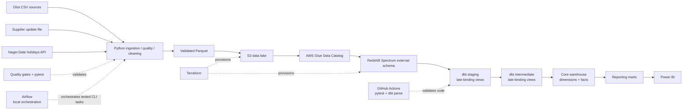

# Architecture

## Warehouse layers

- **Sources:** 11 curated Parquet datasets registered in Glue.
- **Staging:** type casting, naming normalization, source cleanup; late-binding Redshift views because the models reference Spectrum.
- **Intermediate:** one-to-many aggregation and grain protection for payments, reviews, geolocation, products, orders and supplier/product data.
- **Core:** durable analytical dimensions and facts stored in Redshift.
- **Reporting:** business-facing marts for sales, customers, delivery, products, suppliers and data quality.

## Grain rules

- `fct_orders`: one row per `order_id`.
- `fct_order_items`: one row per `order_id + order_item_id`.
- customer analytics use `customer_unique_id`.
- geolocation is reduced to one analytical row per ZIP before joining.
- payment and review sources are aggregated before joining to orders.
- supplier/product updates remain at supplier-product grain and are not joined directly to order items, avoiding false supplier attribution and duplicated revenue.

## Cost controls

- Redshift Serverless workgroup is capped at 4 RPUs.
- A usage limit protects against accidental excessive execution.
- CI performs `dbt parse` only and does not execute warehouse queries.
- Cloud dbt builds are run deliberately and layer-by-layer during development.
