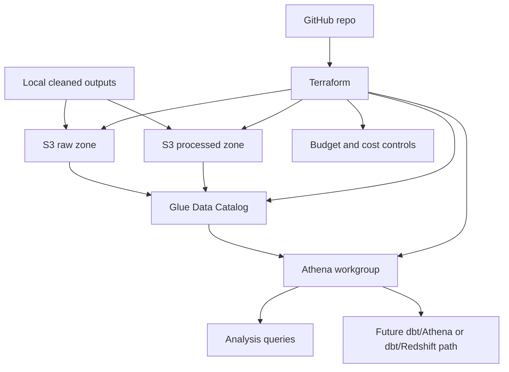

# AWS and Terraform Design

## Purpose

This document defines the planned AWS and Terraform design for the Retail Analytics Data Platform.

The goal is to extend the existing local platform to AWS in a careful, low-cost, and portfolio-friendly way.

This is a design document only. Cloud resources should not be created until the budget-control strategy, service choices, Terraform structure, and destroy workflow are clear.

---

## Design Principles

The AWS extension must follow these principles:

1. Start small.
2. Keep costs predictable.
3. Prefer serverless or pay-per-use services.
4. Avoid always-on compute in the first AWS phase.
5. Keep the local platform working independently.
6. Use Terraform for repeatable infrastructure.
7. Use tags for cost visibility.
8. Use a daily destroy workflow for non-persistent resources.
9. Document every service before using it.
10. Do not move to Redshift until S3/Athena/dbt fundamentals are stable.

---

## Current Local Platform

The current local platform already includes:

```text
Olist CSV files
→ supplier file
→ Brazil holidays API
→ Python profiling, quality checks, and cleaning
→ cleaned outputs
→ PostgreSQL raw schema
→ dbt staging and mart models
→ Power BI dashboard
→ PowerShell runners
→ Airflow DAGs
→ report gates
→ audit tables
→ pytest
→ GitHub Actions CI
```

AWS should extend this platform, not replace it immediately.

---

## Target AWS Direction

The first AWS version should use:

```text
local cleaned outputs
→ S3 raw / processed / curated zones
→ Glue Data Catalog
→ Athena
→ dbt external-source exploration or SQL queries
→ Power BI / local analysis
```

Redshift should be considered later, after the S3/Athena layer is stable.

---

## Recommended First AWS Architecture



---

## AWS Region

Recommended region:

```text
eu-central-1
```

Reason:

* geographically close to the Netherlands
* EU-based region
* suitable for a European portfolio project
* common AWS region for data workloads

Alternative:

```text
eu-west-1
```

This can be used if a specific AWS service is cheaper or easier there, but the first design will assume `eu-central-1`.

---

## Cost-Control Strategy

Cost control is the first priority.

Before creating data resources, configure:

| Control                       | Purpose                                                                      |
| ----------------------------- | ---------------------------------------------------------------------------- |
| AWS Budget                    | Alert when monthly spend exceeds or is forecasted to exceed the chosen limit |
| Free Tier alerts              | Warn when Free Tier usage approaches limits                                  |
| Cost Anomaly Detection        | Detect unexpected spending patterns                                          |
| Resource tags                 | Track project-related costs                                                  |
| Terraform destroy workflow    | Remove non-persistent resources after development sessions                   |
| Athena workgroup query limits | Prevent expensive accidental scans                                           |
| S3 lifecycle rules            | Remove temporary data if needed                                              |

Recommended starting monthly budget:

```text
5 EUR to 10 EUR
```

This is not a guarantee of final cost. It is a safety target for development.

---

## Persistent vs Temporary Resources

Not all resources should be treated the same.

### Persistent Resources

These resources may stay active:

| Resource                           | Reason                                          |
| ---------------------------------- | ----------------------------------------------- |
| S3 bucket for project data         | Low-cost storage and central data lake location |
| Terraform state bucket             | Required for managing infrastructure safely     |
| AWS Budget                         | Needed for cost alerts                          |
| Cost Anomaly Detection monitor     | Needed for billing safety                       |
| IAM user/role/policy for Terraform | Needed for controlled deployment                |

### Temporary Resources

These resources should be created only when needed and destroyed after use:

| Resource                        | Reason                                |
| ------------------------------- | ------------------------------------- |
| Glue crawlers                   | Can create cost if repeatedly run     |
| Glue jobs                       | Compute-based billing                 |
| Redshift Serverless             | Compute cost risk if used incorrectly |
| temporary Athena output folders | Can be cleaned                        |
| experimental resources          | Should not stay active                |

---

## First AWS Service Choice

### Use First

| Service                | Why                                                     |
| ---------------------- | ------------------------------------------------------- |
| S3                     | Data lake storage for raw, processed, and curated files |
| Glue Data Catalog      | Metadata layer for Athena                               |
| Athena                 | Serverless SQL querying over S3                         |
| AWS Budgets            | Cost alerting                                           |
| Cost Anomaly Detection | Billing anomaly alerting                                |
| IAM                    | Controlled access                                       |
| Terraform              | Repeatable infrastructure                               |

### Delay Until Later

| Service             | Reason                                                                        |
| ------------------- | ----------------------------------------------------------------------------- |
| Redshift Serverless | More expensive and more operationally risky than S3/Athena for first AWS step |
| Glue Spark jobs     | Useful later, but not needed for the first cloud migration                    |
| MWAA                | Managed Airflow is too expensive and unnecessary for this portfolio stage     |
| EMR                 | Too heavy for this project stage                                              |
| Kinesis/MSK         | Not needed until real-time streaming phase                                    |

---

## S3 Layout

Recommended S3 layout:

```text
s3://retail-analytics-data-platform-<account-id>-<region>/
  raw/
    olist/
      run_date=2026-05-26/
    supplier/
      run_date=2026-06-01/
    br_holidays/
      run_date=2026-06-16/

  processed/
    olist_clean/
      run_date=2026-05-26/
    supplier_clean/
      run_date=2026-06-01/
    br_holidays_clean/
      run_date=2026-06-16/

  curated/
    marts/
      fct_orders/
      fct_orders_holiday_context/
      dim_customers/
      dim_products/
      dim_sellers/
      dim_br_holidays/

  athena-results/

  temp/
```

Rules:

* use `run_date=YYYY-MM-DD` partitions
* keep raw and processed data separate
* keep Athena query results in a dedicated folder
* keep temporary files under `temp/`
* never mix source files and model outputs in the same prefix

---

## File Format Strategy

Initial upload format:

```text
CSV
```

Reason:

* matches current local outputs
* simplest first migration step
* easiest to validate

Later optimized format:

```text
Parquet
```

Reason:

* better for Athena
* columnar
* usually smaller than CSV
* reduces scanned data
* better for analytics workloads

The first AWS milestone should upload existing cleaned CSV outputs to S3.

The second AWS milestone can convert cleaned outputs to Parquet.

---

## Athena Strategy

Athena should be used for lightweight SQL querying over S3.

Rules:

* create a dedicated Athena workgroup
* set query scan limits
* store query results under `s3://.../athena-results/`
* query cleaned or curated data first
* avoid querying very large raw CSV files unnecessarily
* later use Parquet and partitioning to reduce scanned data

Athena is suitable for the first cloud analytics layer because it does not require a running database server.

---

## Glue Data Catalog Strategy

Glue Data Catalog should provide table metadata for Athena.

Initial approach:

```text
define a small number of external tables manually or with Terraform
```

Avoid running many crawlers at the start.

Reason:

* the dataset is small and known
* manual table definitions are more transparent
* avoids unnecessary crawler runs
* easier to explain in interviews

Glue crawlers can be introduced later as a controlled comparison.

---

## Redshift Strategy

Redshift is not part of the first implementation step.

Redshift can be added later when the project needs:

* warehouse-style SQL performance
* dbt warehouse modeling in AWS
* Power BI connection to a cloud warehouse
* a stronger Analytics Engineer / Data Engineer portfolio story

Recommended Redshift approach later:

```text
S3 curated files
→ Redshift Serverless
→ dbt on Redshift
→ Power BI
```

Budget rule:

```text
Do not create Redshift until a destroy workflow and maximum usage limit are documented.
```

---

## Terraform Structure

Recommended Terraform structure:

```text
infra/
  terraform/
    bootstrap/
      main.tf
      variables.tf
      outputs.tf

    environments/
      dev/
        main.tf
        variables.tf
        outputs.tf
        terraform.tfvars.example

    modules/
      s3_data_lake/
        main.tf
        variables.tf
        outputs.tf

      athena/
        main.tf
        variables.tf
        outputs.tf

      glue_catalog/
        main.tf
        variables.tf
        outputs.tf

      budgets/
        main.tf
        variables.tf
        outputs.tf

      iam/
        main.tf
        variables.tf
        outputs.tf
```

### Bootstrap Layer

Purpose:

* create Terraform state bucket
* enable bucket versioning
* prepare safe state storage

### Dev Environment

Purpose:

* create project resources for development
* keep all resources tagged
* support safe destroy

### Modules

Purpose:

* keep infrastructure reusable
* separate responsibilities
* make the project easier to explain

---

## Terraform State Strategy

Terraform state should not stay only on the local machine after the first bootstrap step.

Recommended backend:

```text
S3 backend with native state locking
```

State bucket should use:

* versioning
* encryption
* blocked public access
* clear naming
* project tags

State file example:

```text
retail-analytics/dev/terraform.tfstate
```

---

## Tagging Strategy

Every AWS resource should include these tags:

```text
Project = retail-analytics-data-platform
Environment = dev
Owner = nasrin
ManagedBy = terraform
CostControl = true
```

Optional tags:

```text
Component = data-lake
Component = athena
Component = glue
Component = budget
```

Tags help with cost tracking, cleanup, and portfolio explanation.

---

## Destroy Workflow

For development resources:

```powershell
terraform plan
terraform apply
# test resources
terraform destroy
```

Before using any expensive service, document:

```text
How to create it
How to test it
How to destroy it
How to confirm it is gone
What cost risk it has
```

Do not leave expensive compute resources running overnight.

---

## Recommended Phase 8 Implementation Order

### Step 8.1 — Design

Create this design document.

### Step 8.2 — AWS account safety setup

Set up:

* billing access
* AWS Budget
* Free Tier alerts
* Cost Anomaly Detection
* IAM access approach

### Step 8.3 — Terraform bootstrap design

Design Terraform state storage.

### Step 8.4 — S3 data lake module

Create S3 bucket structure with safe defaults.

### Step 8.5 — Upload cleaned local outputs to S3

Upload existing cleaned outputs from:

```text
data/processed/
```

to S3.

### Step 8.6 — Glue/Athena minimal query layer

Create:

* Glue database
* selected external tables
* Athena workgroup
* Athena query result location

### Step 8.7 — Athena validation queries

Validate row counts and selected business queries.

### Step 8.8 — Parquet optimization

Convert selected cleaned outputs to Parquet and compare Athena scan behavior.

### Step 8.9 — Redshift design

Only design Redshift after S3/Athena is working.

### Step 8.10 — Redshift implementation

Implement only if budget controls are confirmed.

---

## What Not To Do Yet

Do not start with:

* Redshift Serverless
* MWAA
* EMR
* streaming services
* multi-account AWS setup
* Kubernetes on AWS
* complex CI/CD deployment
* large Glue Spark jobs

These are too heavy for the current phase.

The goal is to build a clean and explainable cloud extension, not an expensive cloud playground.


