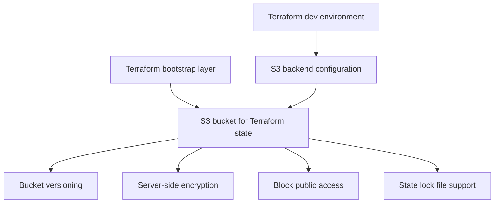

# Terraform Bootstrap Design

## Purpose

This document defines the Terraform bootstrap design for the Retail Analytics Data Platform.

The bootstrap layer prepares the minimum AWS infrastructure needed to safely store Terraform state before creating the actual project data-lake resources.

This is a design document. The bootstrap infrastructure should not be created until the AWS account safety checklist is complete.

---

## Why Terraform Bootstrap Is Needed

Terraform tracks managed infrastructure in a state file.

At the very beginning of a project, there is a bootstrap problem:

```text
Terraform needs remote state storage.
But the remote state bucket must also be created somehow.
```

The solution is to use a small bootstrap layer.

Bootstrap flow:

```text
temporary local Terraform state
→ create protected S3 bucket for Terraform state
→ enable versioning, encryption, and public-access blocking
→ configure dev environment to use the S3 backend
→ migrate future Terraform state to S3
```

After bootstrap, normal project resources should not use local state.

---

## Bootstrap Scope

The bootstrap layer should create only administrative Terraform state resources.

Allowed bootstrap resources:

| Resource                      | Purpose                                                     |
| ----------------------------- | ----------------------------------------------------------- |
| S3 bucket for Terraform state | Stores remote Terraform state files                         |
| S3 bucket versioning          | Allows recovery from accidental state deletion or overwrite |
| S3 server-side encryption     | Encrypts state objects at rest                              |
| S3 public-access block        | Prevents accidental public exposure                         |
| S3 bucket ownership controls  | Keeps bucket ownership predictable                          |
| Optional bucket policy        | Enforces safer access rules if needed later                 |

Not included in bootstrap:

| Resource                 | Reason                                     |
| ------------------------ | ------------------------------------------ |
| project data lake bucket | Created later in the dev environment       |
| Athena workgroup         | Created later                              |
| Glue database            | Created later                              |
| Redshift                 | Delayed                                    |
| Airflow AWS automation   | Delayed until the cloud layer is validated |
| data upload jobs         | Created later                              |
| IAM access redesign      | Designed separately before use             |

---

## Recommended Bootstrap Architecture



---

## Region

The Terraform bootstrap resources should be created in:

```text
eu-central-1
```

Reason:

* EU region
* close to the Netherlands
* consistent with the project AWS design
* suitable for this portfolio project

---

## Backend Strategy

The future dev environment should use the Terraform S3 backend.

Example backend design:

```hcl
terraform {
  backend "s3" {
    bucket       = "retail-analytics-tfstate-<account-id>-eu-central-1"
    key          = "retail-analytics/dev/terraform.tfstate"
    region       = "eu-central-1"
    encrypt      = true
    use_lockfile = true
  }
}
```

Rules:

* do not hardcode AWS credentials in backend configuration
* do not commit secrets
* use an AWS CLI profile or environment-based credentials
* keep one clear state path per environment
* use S3 native lockfile support
* do not use DynamoDB locking for this project unless a future Terraform version or organization standard requires it

---

## State Bucket Naming

Recommended naming pattern:

```text
retail-analytics-tfstate-<account-id>-eu-central-1
```

Example shape:

```text
retail-analytics-tfstate-123456789012-eu-central-1
```

Do not put the real account ID in public documentation.

In Terraform variables, use:

```text
retail-analytics-tfstate-${account_id}-${aws_region}
```

The bucket name must be globally unique.

---

## State File Path

Recommended state path for the dev environment:

```text
retail-analytics/dev/terraform.tfstate
```

Future possible paths:

```text
retail-analytics/bootstrap/terraform.tfstate
retail-analytics/dev/terraform.tfstate
retail-analytics/prod/terraform.tfstate
```

For this portfolio project, only `dev` is needed now.

---

## State Locking

Use S3 native state locking:

```hcl
use_lockfile = true
```

Reason:

* prevents two Terraform runs from changing the same state at the same time
* avoids adding DynamoDB just for locking
* keeps the first AWS phase smaller and cheaper

DynamoDB locking is intentionally not used in the first design.

---

## State Bucket Security Requirements

The Terraform state bucket must have:

| Control                        | Required |
| ------------------------------ | -------- |
| Public access blocked          | Yes      |
| Versioning enabled             | Yes      |
| Server-side encryption enabled | Yes      |
| Deletion protection principle  | Yes      |
| Project tags                   | Yes      |
| No public bucket policy        | Yes      |
| No application data            | Yes      |

The state bucket is not a data lake bucket.

It should contain only Terraform state and lock files.

---

## Required Tags

Every bootstrap resource should use:

```text
Project = retail-analytics-data-platform
Environment = bootstrap
Owner = nasrin
ManagedBy = terraform
CostControl = true
Component = terraform-state
```

---

## Proposed Terraform Folder Structure

```text
infra/
  terraform/
    bootstrap/
      main.tf
      variables.tf
      outputs.tf
      versions.tf
      terraform.tfvars.example
      README.md

    environments/
      dev/
        main.tf
        variables.tf
        outputs.tf
        versions.tf
        backend.tf
        terraform.tfvars.example
        README.md

    modules/
      s3_data_lake/
        main.tf
        variables.tf
        outputs.tf

      athena/
        main.tf
        variables.tf
        outputs.tf

      glue_catalog/
        main.tf
        variables.tf
        outputs.tf

      budgets/
        main.tf
        variables.tf
        outputs.tf
```

For Phase 8.3, only the folder structure and documentation are prepared.

Actual Terraform implementation starts in the next step.

---

## Bootstrap Workflow Design

### Step 1 — Prepare AWS credentials safely

Use a non-root AWS access method.

Do not use the root user for Terraform.

Credential approach will be documented separately before the first `terraform apply`.

### Step 2 — Run bootstrap with temporary local state

From:

```text
infra/terraform/bootstrap/
```

Future command:

```powershell
terraform init
terraform plan
terraform apply
```

This creates the S3 state bucket.

### Step 3 — Configure dev backend

After the state bucket exists, configure:

```text
infra/terraform/environments/dev/backend.tf
```

with the S3 backend.

### Step 4 — Run dev environment with remote state

From:

```text
infra/terraform/environments/dev/
```

Future command:

```powershell
terraform init
terraform plan
terraform apply
```

The dev environment then stores state in S3.

---

## What Should Be Destroyed?

The Terraform state bucket should normally not be destroyed during normal development.

It is an administrative resource.

Destroying it can remove the record of managed infrastructure.

For this project:

| Resource               | Destroy daily?                       |
| ---------------------- | ------------------------------------ |
| Terraform state bucket | No                                   |
| data lake bucket       | Later decision                       |
| Athena workgroup       | Maybe                                |
| Glue database          | Maybe                                |
| Redshift Serverless    | Yes, if ever created for experiments |

---

## What Not To Do Yet

Do not create yet:

* project S3 data-lake bucket
* Glue database
* Athena workgroup
* Redshift
* MWAA
* broad IAM policies
* Airflow AWS DAGs
* data upload automation

These come after the bootstrap and dev environment design are clear.

---

## Interview Explanation

A good interview explanation:

```text
Before creating AWS data resources, I designed a Terraform bootstrap layer. The purpose is to create a protected S3 bucket for Terraform remote state with versioning, encryption, public-access blocking, and state locking. I separated bootstrap infrastructure from the project data-lake environment because Terraform state is administrative and can contain sensitive information. The dev environment will later use this S3 backend with a separate state path.
```

---

## Definition of Done

Phase 8.3 is complete when:

```text
1. docs/terraform_bootstrap_design.md exists
2. it explains why bootstrap is needed
3. it defines the S3 backend strategy
4. it uses eu-central-1
5. it uses S3 native state locking
6. it delays DynamoDB locking
7. it defines the Terraform folder structure
8. it separates bootstrap from dev environment
9. it is committed and pushed
```
